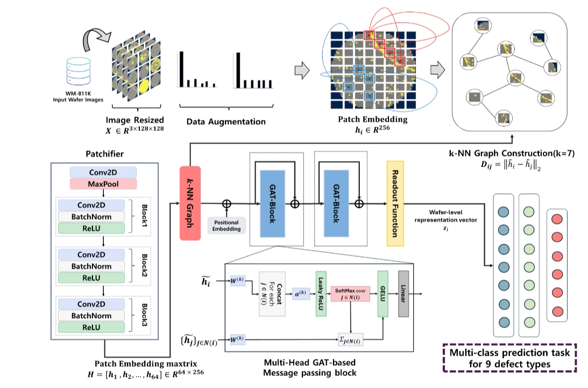

# Patch embedded $k$-NN graph neural networks for wafer defect classification

## Purpose

This repository implements a **CNN-GNN based wafer bin map defect classification framework** that models both local defect features and non-local spatial relationships between wafer regions.

The proposed method converts CNN-based patch features into a graph and applies Graph Neural Networks to capture structural dependencies between spatially separated defect regions.

## Workflow

<p align="center">
  
  <br/>
  <em>Overall workflow of the proposed GNN-based framework for wafer defect classification, illustrating the procedure including patch embedding, $k$-NN graph construction, multi-head GAT-based message passing, and final wafer defect classification.</em>
</p>

## Contributions

- **Graph-based wafer representation**: Converts Wafer Bin Maps into graph structures using CNN-based patch embeddings.
- **Dynamic spatial relationship modeling**: Constructs a dynamic $k$-NN graph to connect feature-similar patches and model non-local defect relationships.
- **GNN architecture comparison**: Compares GCN, GraphSAGE, and GAT under the same experimental setting.
- **Attention-based feature learning**: Applies Multi-head GAT to selectively emphasize important relationships between defect regions.
- **Stable performance evaluation**: Evaluates model performance across 30 independent data splits to verify robustness and reproducibility.

## Key Results

- **Proposed model**: Multi-head GAT
- **Macro-F1**: `0.878 +/- 0.008`
- **CNN baseline Macro-F1**: `0.865 +/- 0.009`
- **Number of patches**: 64
- **Node feature dimension**: 256
- **k-NN neighbors**: 7
- **Classes**: 9  
  (`Center`, `Donut`, `Edge-Loc`, `Edge-Ring`, `Loc`, `Random`, `Scratch`, `Near-Full`, `None`)

---

## Directory Structure

```text
WBM_Classification_GNN/
|-- .vscode/
|-- checkpoints/
|   |-- CNN_classifier.pth
|   |-- VIG_classification-GraphConv.pth
|   |-- VIG_classification-GraphSage.pth
|   |-- VIG_classification-SAGE.pth
|-- dataset/
|   `-- dataset.py
|-- figures/
|   `-- workflow.png
|-- model/
|   |-- model_gat.py
|   |-- model_gcn.py
|   `-- model_graphsage.py
|-- utils/
|   |-- trainer.py
|   `-- utils.py
|-- __pycache__/
|-- main_gat.py
|-- main_gcn.py
|-- main_graphsage.py
`-- README.md
```
