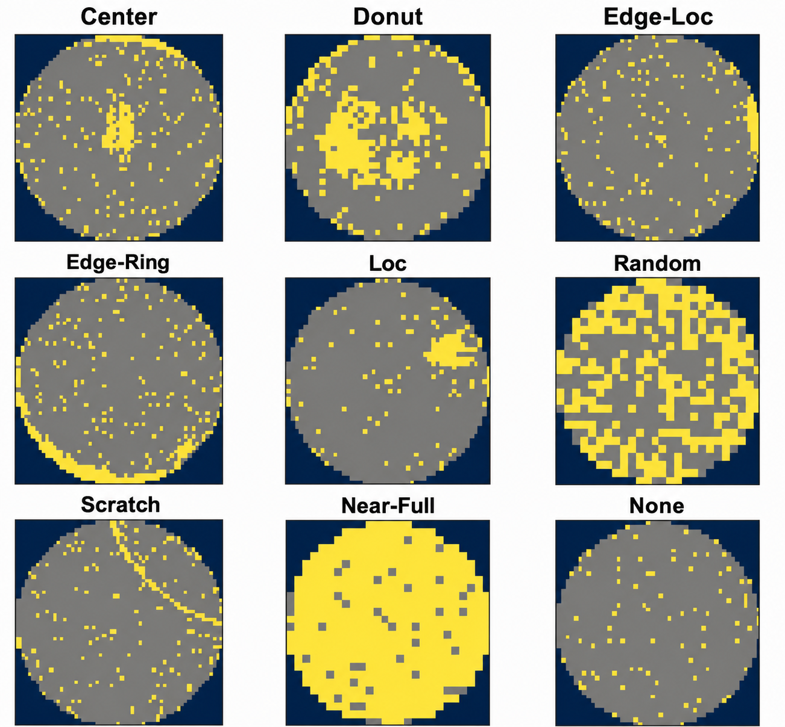

 # WM-811K Dataset Description

- This directory contains the wafer map dataset used for training and evaluation.
- The experiments in this repository are conducted using the **WM-811K wafer map dataset** provided by MIR Lab.

- The WM-811K dataset is publicly available from the MIR Lab website: http://mirlab.org/dataset/public/

  
   
  <em>Example wafer maps from each defect category in WM-811K.</em>

